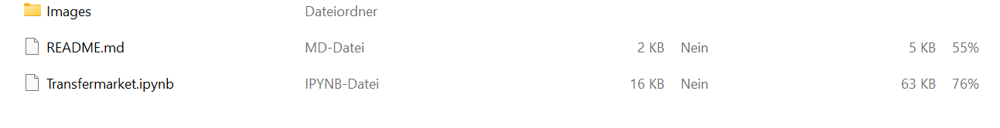

# Transfermarket_Webscraping_-_Data_Analysis
## Goal
In this project, the goal is to analyse questions about the football transfermarket based on data from the website [transfermarkt.ch](https://www.transfermarkt.ch/). Since there is no way to download the needed data directly from the website, a webscraper will be built that will efficently download all the data needed from the website.
## Data used
For this project, I used three different tables I found on and scraped from transfermarket.ch. For the analysis, I additionally used a dataset I got from [`eurostat`](https://pypi.org/project/eurostat/), which displays annual real GDP-Growth Rates in European countries. In summary, I obtained the four following dataframes/tables:
- Total Expenditure on the transfermarket for the top-5 leagues for every year since the year 2000 [(Example)](https://www.transfermarkt.ch/transfers/transfersalden/statistik/plus/0?sa=&saison_id=2022&saison_id_bis=2022&land_id=&nat=&pos=&w_s).
- Dataframe which lists all the individual player transfers that happened in the 2021/22 season [(Example)](https://www.transfermarkt.ch/transfers/saisontransfers/statistik/top/saison_id/2021/transferfenster/alle/land_id//ausrichtung//spielerposition_id//altersklasse//leihe//plus/1/galerie/0/page/).
- Dataframe which shows player statistics for all the players that changed clubs in the 2021/22 season in the season prior to their transfer [(Example)](https://www.transfermarkt.co.uk/Jack-Grealish/leistungsdatendetails/spieler/203460/saison/2020/verein/0/liga/0/wettbewerb//pos/0/trainer_id/0/plus/1).
- Dataframe from Eurostat with annual GDP-Growth Rates for different European countries.

## Programming Language
The programming language used in this proect is **Python**. The code was written in a **Jupyter Notebook** using **Anaconda**.
## Packages needed
- [`pandas`](https://pandas.pydata.org/docs/)
- [`requests`](https://requests.readthedocs.io/en/latest/)
- [`BeautifulSoup`](https://beautiful-soup-4.readthedocs.io/en/latest/)
- [`numpy`](https://numpy.org/doc/stable/)
- [`re`](https://docs.python.org/3/library/re.html)
- [`eurostat`](https://pypi.org/project/eurostat/)
- [`matplotlib`](https://matplotlib.org/)
- [`statsmodels`](https://www.statsmodels.org/stable/index.html)
## How to run
If you want to run this project you need to do following steps:
1. Donwload the project from github as a zip file and open it on your own device. Make sure that all files are in the **same** directory/folder. After opening the zip file you should have a folder that looks like this:

2. Run the juypyter notebook *Transfermarket.ipynb*. You can run it in wathever environment you like in which you can run a jupyter notebook. If you don't already have an environment to run the juypter notebook, I'll explain how you can install one under *Installation*
3. To best understand the code, you shoul run it cell by cell. I provide all the information you need to understand what the code does and you need to run it in the jupyter notebook. You can also run the whole notebook at once.

*Please note that, due to the webscraping, running the code takes some time (you need to scrape through around 1'000 web pages). There are three cell where I use webscraping. At these three cells, you need to wait some minutes. If you run the whole script at once, the runtime should be around **30 minutes**.*

## Installation

- Step 1: Download and Install Anaconda (https://www.anaconda.com/download/) - preinstalled packages with python 3 - with this step we will switch to executing code on your PC (Note: select an easy to remember folder - eg: c:\anaconda3)
- Step 2: Once you install Anaconda you should be able to run jupyter notebook which is a powerful online application containing an ordered list of input/output cells which can contain code, text, mathematics, plots and rich media.
- Step 3: Launch jupyter notebook by opening a terminal in your PC: example in Windows --> Click on Run and neter cmd.exe - terminal window shoudl appear - type in: C:\Python>jupyter notebook

(Source: https://codingxcamp.com/levels/level2?lang=Python&taskid=600&levelskill=2)

## Sources
All the sources are mentioned in the appropriate spot in the jupyter notebook.
